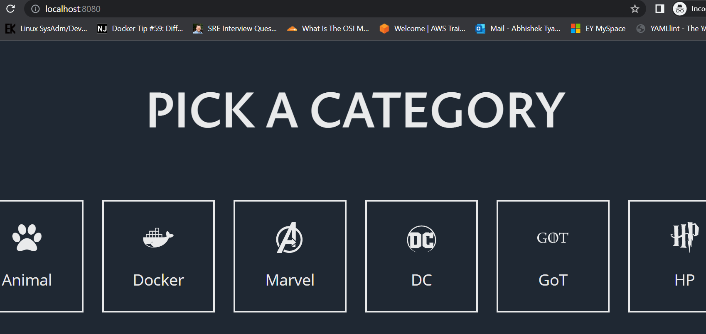

# Sprint-Name-Generator
Clone and follow the instructions below to run a local instance of Sprint-Name-Generator app.

## Usage

### docker-compose.sh

This script can be used to build and deploy the blue and green version of the app.
It uses a docker-compose file to build and run the docker containers. 

usage: `docker-compose.sh <param>`

1. Once you have cloned repo, change the working directory

`cd sprint-name-generator`


2. To deploy blue version - run below command:

``` bash
$ ./docker-compose.sh blue
```
- After successful run you should see something like
```
.
.
Blue is deployed!
```
- Running docker containers can be seen as 

```
$ docker ps
CONTAINER ID   IMAGE                        COMMAND                  CREATED          STATUS          PORTS                  NAMES
094fe210eda1   nginx                        "/docker-entrypoint.…"   26 seconds ago   Up 22 seconds   0.0.0.0:8080->80/tcp   sprint-name-generator-proxy-1
3e11b5037256   sprint-name-generator_blue   "/docker-entrypoint.…"   26 seconds ago   Up 24 seconds   80/tcp                 sprint-name-generator-blue-1
```
- Go to browser and type the following to make sure its working as expected.
`http://localhost:8080`


3. To make a visible change in code, run the below command.

```
$ sed -i 's/PICK A CATEGORY/PICK A CHARACTER/g' web/src/index.js
```
4. To deploy new (say green) version of the app - run below command:
``` bash
$ ./docker-compose.sh green
```
- After successful run you should see something like
```
.
.
Green is deployed successfully!
```
- New running docker containers can be seen again as

```
$ docker ps
CONTAINER ID   IMAGE                         COMMAND                  CREATED              STATUS              PORTS                  NAMES
8eec96b35cd4   sprint-name-generator_green   "/docker-entrypoint.…"   About a minute ago   Up About a minute   80/tcp                 sprint-name-generator-green-1
fc757d0de78c   nginx                         "/docker-entrypoint.…"   16 minutes ago       Up 16 minutes       0.0.0.0:8080->80/tcp   sprint-name-generator-proxy-1
ce56db4e8066   sprint-name-generator_blue    "/docker-entrypoint.…"   16 minutes ago       Up 16 minutes       80/tcp                 sprint-name-generator-blue-1
```
5. Now, go to browser and do a refresh to see any change.

    `No change observed?`

- Wait! we haven't re-routed the traffic to the new deployment yet. To do that run the following script:

    `./reload-nginx.sh`
- Go back to browser once again and do a refresh to see the change ;-)

  

_Note: In a live environment we can keep running the old deployment as it is until the new deployment is fully tested._


